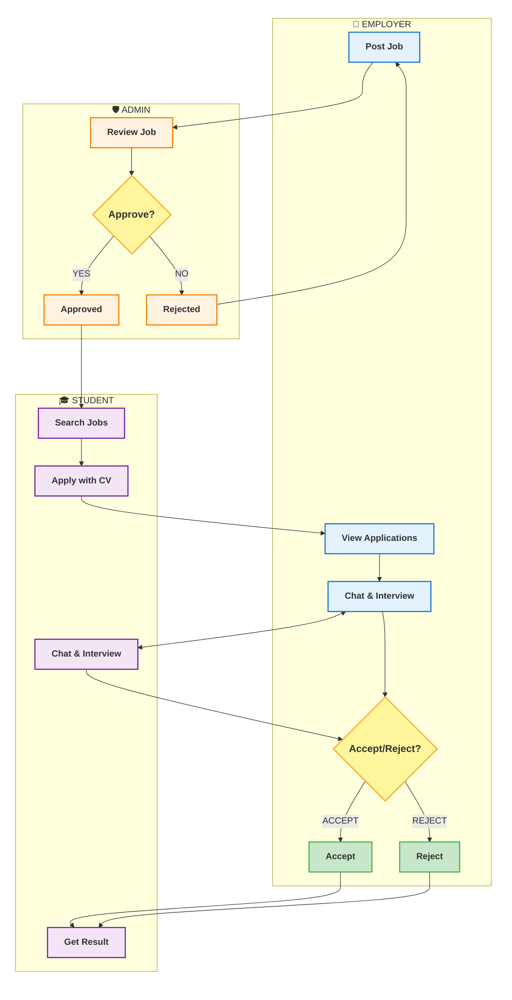

# Swimlane Diagram - Job4You Main Flow

## Overview
Job4You system has 3 main actors:
1. **Employer** - Post jobs, manage candidates, send interview schedules, chat
2. **Admin** - Approve job posts from employers
3. **Student** - Apply for jobs, receive interview schedules, chat with employers

## Swimlane Diagram



## Main Flow - Simple & Clean

| Step | Employer | Admin | Student |
|------|----------|-------|---------|
| 1 | **Post Job** | | |
| 2 | | **Review Job** → Approve/Reject | |
| 3 | | | **Search Jobs** → **Apply with CV** |
| 4 | **View Applications** | | |
| 5 | **Chat & Interview** ↔ | | **Chat & Interview** |
| 6 | **Accept/Reject Decision** | | |
| 7 | | | **Get Final Result** |

## Process Flow

1. **Job Creation**: Employer posts → Admin reviews → Approved jobs go live
2. **Application**: Student searches and applies
3. **Communication**: Employer and Student chat → Schedule interview
4. **Decision**: Employer accepts/rejects → Student gets result

## Layout: True Vertical Columns (Swimlane)

### Current Setup:
- **`graph TB`**: Top to Bottom layout 
- **3 separate columns**: Employer, Admin, Student
- **Hidden borders**: Ẩn border ngoài để chỉ hiện swimlane

### Column Order (Left to Right):
1. **👔 EMPLOYER** - Post jobs, manage candidates
2. **🛡️ ADMIN** - Review and approve jobs  
3. **🎓 STUDENT** - Search and apply for jobs

### To Reorder Columns:
Change the order of subgraphs:
```mermaid
subgraph col1[" "]          %% First column
    subgraph STUDENT["🎓 STUDENT"]
subgraph col2[" "]         %% Second column  
    subgraph EMPLOYER["👔 EMPLOYER"]
```

**Result**: Clean 3-column swimlane diagram!
